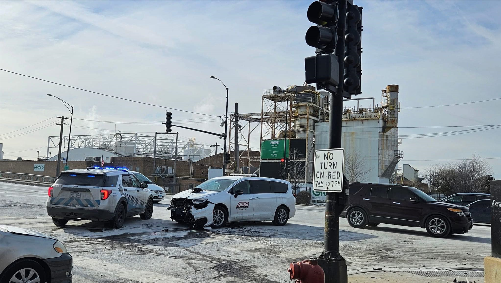

# Predicting Primary Contributory Causes of Car Crashes in Chicago




# 🚧 Business Problem and Goal

The **City of Chicago's Traffic Management Department** currently lacks a systematic and predictive mechanism to identify the primary contributory causes of car accidents. This limits their ability to proactively address accident triggers, resulting in inefficient resource allocation and potentially higher rates of preventable incidents.

### 🎯 Project Objective
Develop a **machine learning model** to predict the primary contributory cause of car accidents in Chicago.

### 🏆 Business Goals
- **Accurately predict** the cause of an accident using crash, vehicle, person, and environmental data.
- **Enable proactive, data-driven decisions** by:
  - Identifying high-risk road segments.
  - Launching targeted public awareness campaigns.
  - Optimizing traffic management strategies.

> Ultimately, reduce accident frequency, injuries, and associated costs through intelligent data utilization.

---

# 📊 Data Sources

Data used was sourced from the **Chicago Data Portal**, specifically:

- `Traffic_Crashes_Crashes.csv`: Crash-level details (date, time, location, conditions, primary cause).
- `Traffic_Crashes_People.csv`: Person-level details (age, sex, injury class, BAC results).

---

# 🔍 Methodology

## 🧹 Data Loading & Cleaning
- Loaded using `pd.read_csv` with `nrows=100000` for memory control.
- Used `on_bad_lines='skip'` and `encoding='latin1'`.
- Dropped columns with >80% missing and redundant identifiers.

## 🔗 Merging & Feature Engineering
- Aggregated person-level data:  
  - `NUM_PEOPLE_INVOLVED`, `PEOPLE_INJURY_COUNTS`, `CRASH_HAS_ALCOHOL_TEST`, `CRASH_HAS_DRIVER`.
- Merged using `CRASH_RECORD_ID`.
- Extracted features from `CRASH_DATE`:  
  `CRASH_YEAR`, `CRASH_MONTH`, `CRASH_DAY_OF_WEEK`, `CRASH_HOUR`, `IS_WEEKEND`, `IS_RUSH_HOUR`.
- Grouped rare `PRIM_CONTRIBUTORY_CAUSE` values (<0.5%) into `'OTHER'`.

## 🛠️ Preprocessing Pipeline
- Split data: 80% train / 20% test using `train_test_split` with `stratify=y`.
- Used `ColumnTransformer`:
  - **Numerical**: Median imputation → StandardScaler.
  - **Categorical**: Most frequent imputation → OneHotEncoder.

## 🤖 Model Training
- Baseline models:  
  Logistic Regression, Decision Tree, Random Forest (with `class_weight='balanced'`) + **SMOTE** via `imblearn.pipeline.Pipeline`.
- Advanced model: **LightGBMClassifier** with SMOTE integration.

## 🧪 Hyperparameter Tuning
- Used `GridSearchCV` on LightGBM:
  - Tuned: `n_estimators`, `learning_rate`, `num_leaves`, `max_depth`.
  - Scoring: `'f1_weighted'`, `cv=3`.

## 📈 Evaluation Metrics
- **Accuracy**
- **Classification Report** (Precision, Recall, F1)
- **Confusion Matrix**
- **Feature Importance Plot**

---

# 📌 Key Findings & Results

## 🥇 LightGBM Outperforms
- **Best Accuracy**: ~0.4138  
- **Best F1-Weighted Score**: ~0.3779  
- Outperformed Logistic Regression & Decision Tree.

## ⚠️ Random Forest Overfitting
- Train Accuracy ~1.0  
- Test Accuracy significantly lower.

## ⚖️ Class Imbalance Challenges
- Even with `class_weight` and SMOTE, minority classes had low recall & F1.
- High support classes (e.g. **"UNABLE TO DETERMINE"**, **"FAILING TO REDUCE SPEED"**) performed better.

## 🔍 Feature Importance (LightGBM)

### Top Influential Features:
- `CRASH_HOUR`, `BEAT_OF_OCCURRENCE`
- `CRASH_DAY_OF_WEEK`, `CRASH_MONTH`, `CRASH_YEAR`
- `POSTED_SPEED_LIMIT`
- `IS_RUSH_HOUR`, `NUM_UNITS`
- `FIRST_CRASH_TYPE` categories (e.g., REAR_END, ANGLE)
- `TRAFFICWAY_TYPE_*`
- `DAMAGE_OVER_$1,500`, `IS_WEEKEND`, `LIGHTING_CONDITION_DAYLIGHT`

---

# 📋 Classification Report (LightGBM)

```
[Classification Report Snippet Removed for Brevity]
```

---

# 🔁 Confusion Matrix (LightGBM + SMOTE)

### Key Observations:
- Diagonal: Correct predictions (darker = better).
- `UNABLE TO DETERMINE` has the highest correct predictions.
- Low-support classes are frequently misclassified.

---

# ❌ Limitations

- **Data Sampling**: Only 100,000 rows used.
- **Class Imbalance**: Even with balancing techniques, rare causes are difficult to predict.

---

# 💡 Recommendations & Future Work

## 📉 Improve Imbalance Handling
- Try **SMOTE-Tomek**, **SMOTE-ENN**, or **cost-sensitive learning**.

## 🧪 Advanced Hyperparameter Tuning
- Use `Optuna`, `Hyperopt`, or `RandomizedSearchCV`.

## 🧬 Enhanced Feature Engineering
- Create **interaction features** (e.g., `WEATHER` × `LIGHTING_CONDITION`).
- Include **external sources** (e.g., real-time traffic, events).
- Add **geospatial data** (e.g., crash hotspots).

## 🔍 Error Analysis
- Qualitative review of misclassifications.

## 🤝 Model Ensembling
- Stack/Blend **LightGBM** with **XGBoost** or **CatBoost**.